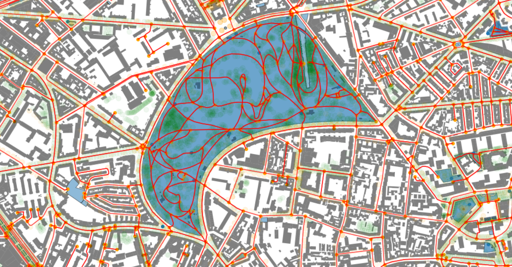
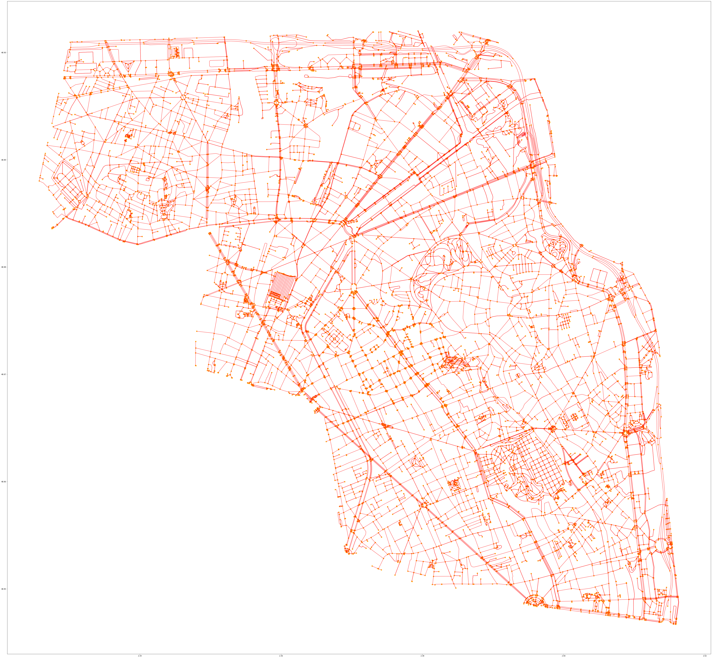

# MyWay in Paris

App running at [https://mparismap.herokuapp.com/](https://mparismap.herokuapp.com/) . 

## Content

* [Streamlit app folder](./app/)
* [00.PreparingData.ipynb](00.PreparingData.ipynb) (pre processing from opendatasets)
* [01.Stats.ipynb](01.Stats.ipynb): initial insights (to be completed)
* [02.PreparingRouteFinder.ipynb](02.PreparingRouteFinder.ipynb): draft router finder
* [03.CastingShadows.ipynb](03.CastingShadows.ipynb): running tests with shadows mapping

## Done

* Zoning on arrondissements 18, 19, 20, 10, 11
* Been getting all routes from within OSM
* Preliminary mapping of best route based on trees
* Trees and lighting are put in
* Add shadows

## Other data layers? 

* Use distance to fountains, parcs, green spaces
  * What other layers to use?
* Develop something from building footprint (in data/BoI_simple.pkl)

# Images

* Example of the network

* Merging all buildings in one

* Details of streets

# Learn and try

## The data processing API

1. Find
  * Should get: X,Y start, X,Y end + set of preferences ("weights")
  * Should receive, waypoints (nodes) (ordered list of XYs), and layers of interest close to the path (XYs of trees, lights, .. ) 
2. Up: tells if the API is up
3. Discover: sends end start users, settings - cache available

## Goodies, API side

#### Caching

* Define
  * Defining them: So to have a couple of from-to couples, and personas (ie prepared sets of weights)
  * Store results in dataframe
* Run route finders and cache results
  * Start
  * End
  * Weights
  * Returns: json with waypoints, trees, lights, parcs, shadows

## Visualisation

* Streamlit: 
  * inputs
  * map
  * description of the map on the right

* Personas + "you"
  * Luc: home->work (day), then work->home night (shadows, light)
  * Anna: montmartre->b&b in 19th : trees and lights
  * Laure: South of 12th -> la villette